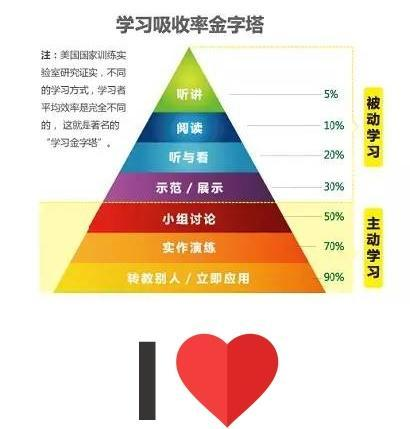

# 学习方法
	
	工欲善其事，必先利其器。
	方法学习的再多，不去用，都是废物。

## 费曼学习法 Feynman Technique

**步骤**

1. 获取某个知识/某概念，并且去理解这些内容
2. 按照教程自己来讲解/复述你获得的主要内容
3. 用自己的方式再次复述一下所学到的知识。
4. 循环
- 不满意-纠错反馈
- 满意-尝试运用更简练的语言概括
5. 反思。 反思你在思考的时候在哪里卡壳，着重这个地方，再次理解。重要
6. 校验，通过不断的进行实践才能巩固你对于该知识点的理解。

费曼学习可以考量自己对一个概念或知识是否理解，一个最直观的方法就是讲给别人听，如果能够用简洁清晰的语言让别人完全听懂你在说什么，就证明你完全了解所学的概念；反之则还需要再认真学习。

这种方法在学习理论性，概念性较强的知识是非常实用的。学习一个新的概念知识，并且充分理解它，然后再用自己的语言，自己的方式去复述它，而不是仅仅死记硬背。这样获得的知识才能真正内在化，进入你的大脑。

**学习吸收率金字塔**

## 思维导图学习法 Mind Mapping

**好处**

- 方面记录，加强记忆
- 过程非常自由
- 结果清晰

**重点**
- 中心点
- 分支线
- 关键词
- 个性标

## 西蒙学习法(锥形学习法)Simon lerning method

	源于诺贝尔经济学奖获得者西蒙教授提出的一个理论
	对于一个有一定基础的人来说，只要真正肯下功夫，在六个月内就可以掌握任何一门靴们。
	为了形象地说明，可以将西蒙学习法比作一把锥子。就像居里夫人梭说，“知识的专一性像锥尖，精力的集中好比是锥子的作用力，时间的连续性好比是不停顿地使锥子往前钻进”。

**原理**
	
	连续的长时间学习本身包涵对之前学习内容的应用，这样就省去了大量的复习时间。

**核心**
	
1. 持续（持续性的时间投入）
2. 专注（精神集中）
3. 目标单一（以某一技能提升为目标）

集中单一课程，短期内突破。比可以练习少了学习区的概念和既然反馈原则。

## SQ3R阅读法

	SQ3R即S-Q-R-R-R

1. 浏览Survery,在浏览的过程中是要注意书籍/文章的重要信息，包括书名，前言，目录，标题，图表，概要等等
2. 提问Question 
	浏览的过程中不仅仅是看，更要提出问题，从书名，标题上就可以开始提问题，包括各章节承上启下的内容，一边浏览一边提问是有益于激发学习兴趣。
3. 阅读Read
	精读细读，要对重要的，难解的部分反复阅读，并且自己要深刻理解。这一步一定要仔细认真。
4. 复述Recile
	当你阅读完了之后，把书本/文章合上，回忆内容，并且用自己的语言复述内容/知识。这一步可以结合第二个步骤提问一起来进行，看看自己开始的提问有没有得到正确的回答，来校验自己是否读懂了。
5. 复习Review
	任何知识都是需要复习的.SQ3R 阅读法建议复习一般在复述的后一两天进行。这样做的好处是，可以重温已有的知识，也可以温故知新，从旧的知识里生出新的感悟。

## 文章

1. [费曼学习法详解](https://baijiahao.baidu.com/s?id=1651672499356748106&wfr=spider&for=pc) 
